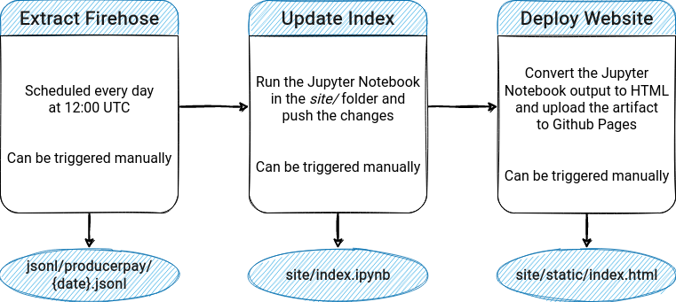

# EOS - Blockchain Data for Analytics (Python version)

[](https://github.com/Krow10/eos-blockchain-data/actions/workflows/pylint.yml)

[](https://github.com/Krow10/eos-blockchain-data/actions/workflows/firehose_daily_extraction.yml)
[](https://github.com/Krow10/eos-blockchain-data/actions/workflows/update_index_notebook.yml)
[](https://github.com/Krow10/eos-blockchain-data/actions/workflows/static.yml)

> Aggregates historical EOS blockchains data & outputs result into JSONL format (using [dfuse **Firehose**](https://dfuse.eosnation.io/))

**Supported chains:**
- [x] EOS
- [x] Jungle4
- [x] Kylin
- [x] WAX
- [ ] Telos
- [ ] UX

## Github Actions workflow

This repo uses Github actions to automatically fetch transactions related to EOS block producer's (BP) addresses payments, parse them and generate a [Sankey chart](https://en.wikipedia.org/wiki/Sankey_diagram) for visualizing the flow of funds. Below is a flow diagram showing what the actual pipeline looks like:



You can see the rendered chart [here](https://krow10.github.io/eos-blockchain-data/) at the bottom of the page.

## Quickstart

```console
foo@bar:~$ git clone git@github.com:Krow10/eos-blockchain-data.git
foo@bar:~$ cd eos-blockchain-data
foo@bar:~/eos-blockchain-data$ nano sample.env # Edit sample .env file with editor of your choice and add your DFUSE_API_TOKEN
foo@bar:~/eos-blockchain-data$ mv sample.env .env # Rename to .env
```

### Environment variables

[Sample `.env` file](sample.env):
```env
# [REQUIRED] Authentication to Firehose endpoint (see https://docs.dfuse.eosnation.io/platform/dfuse-cloud/authentication/)
DFUSE_TOKEN=<DFUSE_API_TOKEN>

# [OPTIONAL] Endpoint for getting authentication token
AUTH_ENDPOINT="https://auth.eosnation.io/v1/auth/issue"
# [OPTIONAL] Endpoint for querying block numbers from date
DFUSE_GRAPHQL_ENDPOINT="https://eos.dfuse.eosnation.io/graphql"
```

Follow the instructions on the [dFuse documentation website](https://docs.dfuse.eosnation.io/platform/dfuse-cloud/authentication/#types-of-keys) to generate an API key and copy it to your `.env` file (the JWT token authentication is handled by the [script](utils.py#L70) itself).

### Python

```console
foo@bar:~/eos-blockchain-data$ python3 -m venv .venv # Create virtual environnement
foo@bar:~/eos-blockchain-data$ source .venv/bin/activate # Activate virtual environnement
(.venv) foo@bar:~/eos-blockchain-data$ pip install -r requirements.txt # Install dependencies
(.venv) foo@bar:~/eos-blockchain-data$ python main.py -h
usage: main.py [-h] [-c {eos,wax,kylin,jungle4}] [-n MAX_TASKS] [-o OUT_FILE] [-l [LOG]] [-q] [-x CUSTOM_EXCLUDE_EXPR] [-i CUSTOM_INCLUDE_EXPR] [-p CUSTOM_PROCESSOR]
               [--disable-signature-check]
               accounts [accounts ...] start end

Search the blockchain for transactions targeting specific accounts over a given period. Powered by Firehose (https://eos.firehose.eosnation.io/).

positional arguments:
  accounts              target account(s) (single or space-separated)
  start                 period start as a date (iso format) or a block number
  end                   period end as a date (iso format) or a block number

optional arguments:
  -h, --help            show this help message and exit
  -c {eos,wax,kylin,jungle4}, --chain {eos,wax,kylin,jungle4}
                        target blockchain (default: eos)
  -n MAX_TASKS, --max-tasks MAX_TASKS
                        maximum number of concurrent tasks running for block streaming (default: 20)
  -o OUT_FILE, --out-file OUT_FILE
                        output file path (default: jsonl/{chain}_{accounts}_{start}_to_{end}.jsonl)
  -l [LOG], --log [LOG]
                        log debug information to log file (can specify the full path) (default: logs/{datetime}.log)
  -q, --quiet           disable console logging (default: False)
  -x CUSTOM_EXCLUDE_EXPR, --custom-exclude-expr CUSTOM_EXCLUDE_EXPR
                        custom filter for the Firehose stream to exclude transactions (default: None)
  -i CUSTOM_INCLUDE_EXPR, --custom-include-expr CUSTOM_INCLUDE_EXPR
                        custom filter for the Firehose stream to tag included transactions (default: None)
  -p CUSTOM_PROCESSOR, --custom-processor CUSTOM_PROCESSOR
                        relative import path to a custom block processing function located in the "block_processors" module (default: None)
  --disable-signature-check
                        disable signature checking for the custom block processing function (default: False)
```

Specify one or more accounts by separating them with a space. The period's *start* and *end* accepts either a block number or a [ISO-like formatted date time](https://docs.python.org/3/library/datetime.html#datetime.datetime.isoformat). By default, the extracted data will be stored in a `.jsonl` file inside the [`jsonl/`](jsonl/) directory.

A [`.pylintrc`](.pylintrc) file is provided if you want to run [Pylint](https://pypi.org/project/pylint/):
```console
(.venv) foo@bar:~/eos-blockchain-data$ pylint ./main.py ./utils.py ./block_processors/default.py 
************* Module utils
utils.py:30:26: W0511: TODO: Catch exception (fixme)
utils.py:66:83: W0511: TODO: Raise exception (fixme)
utils.py:96:64: W0511: TODO: Raise exception (fixme)
************* Module main
main.py:124:0: C0301: Line too long (121/120) (line-too-long)
main.py:137:47: W0511: TODO: Add exception handling (fixme)
main.py:196:26: W0511: TODO: Add exception handling (fixme)
main.py:31:0: W0105: String statement has no effect (pointless-string-statement)

------------------------------------------------------------------
Your code has been rated at 9.64/10 (previous run: 9.58/10, +0.06)
```

### Protobuf

To communicate with the gRPC endpoint, Python object are generated through the use of `.proto` file templates that describes the kind of data the client and server are going to manipulate. Those Python object are already provided in the [`proto/`](proto/) folder, however if you want to generate them yourself, you can run the following commands:
```console
(.venv) foo@bar:~/eos-blockchain-data$ pip install grpcio-tools
(.venv) foo@bar:~/eos-blockchain-data$ python -m grpc_tools.protoc -Iproto --python_out=proto/ --grpc_python_out=proto/ proto/*.proto
```

## Using custom filters

By default, the script will look for all *transfer* actions with the targeted accounts as the contract's *receiver* (which can be different from the recipient of the transaction) meaning that all transactions *from* and *to* those adresses will be accounted for.

Let's say you just wanted outgoing transactions from certain accounts. You could use the `--custom-include-expr` argument like so:
```console
(.venv) foo@bar:~/eos-blockchain-data$ python main.py $TARGET $START $END --custom-include-expr "receiver == '${TARGET}' && data['from'] == '${TARGET}' && action == 'transfer'"
```
This specifies that only *transfer* transactions *from* the `TARGET` should be included in the resulting `.jsonl` file.

You could also write it using the `--custom-exclude-expr` argument, taking advantage of the default transaction inclusion behavior:
```console
(.venv) foo@bar:~/eos-blockchain-data$ python main.py $TARGET $START $END --custom-exclude-expr "data['to'] == '${TARGET}'"
```
For reference about the default behavior, see [`main.py`](main.py#L127-L128).

For full documentation about the syntax and variables available in the filter expressions, see the [Firehose documentation](https://github.com/streamingfast/playground-firehose-eosio-go#query-language).

## Writing custom block processors

For even more control over the data extracted, the extraction process uses a modular approach for manipulating `Block` objects coming from the Firehose gRPC stream. A block processing function is used for extracting the data into `Dict` objects that are later stored in a `.jsonl` file at the end of the process. Customizing which data is extracted is the objective of writing a custom block processor. The default behavior is documented in the [`eos_block_processor`](block_processors/default.py#L15) function.

In order to write custom block processing functions, some conditions must be respected:
- The function signature should strictly follow the following model: `func(codec_pb2.Block) -> Dict` (you can disable the signature check with the `--disable-signature-check` flag, however this is not recommended and might break the script if your function isn't parsing the block data as expected).
- The function should act as a **generator** (using the `yield` keyword) to return the dictionary data.
- The function should be placed inside a seperate `.py` file in the [`block_processors`](block_processors/) module.

A typical template for parsing the block data would look like the following:
```python
for transaction_trace in block.filtered_transaction_traces: # Gets every filtered TransactionTrace from a Block
  for action_trace in transaction_trace.action_traces: # Gets every ActionTrace within a TransactionTrace
    if not action_trace.filtering_matched: # Only keep 'transfer' actions that matched the filters
      continue

    data = {}
    
    # Process the data...

    yield data # Make the function act as a generator
```

For documentation about `Block`, `TransactionTrace`, `ActionTrace` or other objects and their properties, please refer to the [`codec.proto`](proto/codec.proto) file.

You can then use custom block processors through the command-line using the `--custom-processor` argument and providing the relative import path **from the `block_processors` module**. 

For example, let's say you've implemented a custom function `my_block_processor` in `custom.py`. The `custom.py` script should reside at the root or in a subdirectory inside the `block_processors` folder (let's say it's at the root for this example). You would then pass the argument as `--custom-processor custom.my_block_processor`. The script will locate it inside the `block_processors` module and use the `my_block_processor` function to parse block data and extract it to the output file.

## Example

### Input

```console
(.venv) foo@bar:~/eos-blockchain-data$ python main.py eosio.vpay eosio.bpay 272368521 272369521 --quiet --log logs/eosio_pay.log --out jsonl/out.jsonl
```

### Output (jsonl/out.jsonl)

```jsonl
{"account": "eosio.bpay", "date": "2022-10-10 00:00:12", "timestamp": 1665360012, "amount": "40.1309", "token": "EOS", "from": "eosio", "to": "eosio.bpay", "block_num": 272368521, "transaction_id": "e34893fbf5c1ed8bd639b4b395fa546102b6708fbd45e4dcd0d9c2a3fc144b75", "memo": "fund per-block bucket", "contract": "eosio.token", "action": "transfer"}
{"account": "eosio.vpay", "date": "2022-10-10 00:00:12", "timestamp": 1665360012, "amount": "120.3927", "token": "EOS", "from": "eosio", "to": "eosio.vpay", "block_num": 272368521, "transaction_id": "e34893fbf5c1ed8bd639b4b395fa546102b6708fbd45e4dcd0d9c2a3fc144b75", "memo": "fund per-vote bucket", "contract": "eosio.token", "action": "transfer"}
{"account": "eosio.bpay", "date": "2022-10-10 00:00:12", "timestamp": 1665360012, "amount": "343.8791", "token": "EOS", "from": "eosio.bpay", "to": "aus1genereos", "block_num": 272368521, "transaction_id": "e34893fbf5c1ed8bd639b4b395fa546102b6708fbd45e4dcd0d9c2a3fc144b75", "memo": "producer block pay", "contract": "eosio.token", "action": "transfer"}
{"account": "eosio.vpay", "date": "2022-10-10 00:00:12", "timestamp": 1665360012, "amount": "675.7402", "token": "EOS", "from": "eosio.vpay", "to": "aus1genereos", "block_num": 272368521, "transaction_id": "e34893fbf5c1ed8bd639b4b395fa546102b6708fbd45e4dcd0d9c2a3fc144b75", "memo": "producer vote pay", "contract": "eosio.token", "action": "transfer"}
{"account": "eosio.bpay", "date": "2022-10-10 00:02:56", "timestamp": 1665360176, "amount": "13.7532", "token": "EOS", "from": "eosio", "to": "eosio.bpay", "block_num": 272368850, "transaction_id": "22b736b6662a5fae94b4e37b11d6c9fa324b4a85d434da9afd92227913aa8dc6", "memo": "fund per-block bucket", "contract": "eosio.token", "action": "transfer"}
{"account": "eosio.vpay", "date": "2022-10-10 00:02:56", "timestamp": 1665360176, "amount": "41.2596", "token": "EOS", "from": "eosio", "to": "eosio.vpay", "block_num": 272368850, "transaction_id": "22b736b6662a5fae94b4e37b11d6c9fa324b4a85d434da9afd92227913aa8dc6", "memo": "fund per-vote bucket", "contract": "eosio.token", "action": "transfer"}
{"account": "eosio.bpay", "date": "2022-10-10 00:02:56", "timestamp": 1665360176, "amount": "344.5057", "token": "EOS", "from": "eosio.bpay", "to": "newdex.bp", "block_num": 272368850, "transaction_id": "22b736b6662a5fae94b4e37b11d6c9fa324b4a85d434da9afd92227913aa8dc6", "memo": "producer block pay", "contract": "eosio.token", "action": "transfer"}
{"account": "eosio.vpay", "date": "2022-10-10 00:02:56", "timestamp": 1665360176, "amount": "698.0213", "token": "EOS", "from": "eosio.vpay", "to": "newdex.bp", "block_num": 272368850, "transaction_id": "22b736b6662a5fae94b4e37b11d6c9fa324b4a85d434da9afd92227913aa8dc6", "memo": "producer vote pay", "contract": "eosio.token", "action": "transfer"}
```

### Log file sample (logs/eosio_pay_.log)

```
T+126 [DEBUG] Script arguments: Namespace(accounts=['eosio.vpay', 'eosio.bpay'], start=272368521, end=272369521, chain='eos', max_tasks=20, out_file='jsonl/out.jsonl', log='logs/eosio_pay.log', quiet=True, custom_exclude_expr=None, custom_include_expr=None, custom_processor=None, disable_signature_check=False)
T+126 [DEBUG] Using selector: EpollSelector
T+126 [DEBUG] Initializing backend: None jwt_token
T+126 [DEBUG] Initializing SQLitePickleDict with serializer: <requests_cache.serializers.pipeline.SerializerPipeline object at 0x7c13daa6e160>
T+126 [DEBUG] Opening connection to /home/user/Documents/eos-blockchain-data/jwt_token.sqlite:responses
T+127 [DEBUG] Initializing SQLiteDict with serializer: <requests_cache.serializers.pipeline.SerializerPipeline object at 0x7c13daa6e160>
T+127 [DEBUG] Opening connection to /home/user/Documents/eos-blockchain-data/jwt_token.sqlite:redirects
T+127 [*] Getting JWT token...
T+128 [DEBUG] Cache directives from request headers: {}
T+131 [DEBUG] JWT response: {'token': 'eyJhbGciOiJIUzI1NiIsInR5cCI6IkpXVCJ9.eyJhdWQiOlsiaHR0cHM6Ly9kZnVzZS5lb3NuYXRpb24uaW8vIl0sImV4cCI6MTY2NjU1MDkyNSwiaWF0IjoxNjY2NDY0NTI1LCJpc3MiOiJodHRwczovL2FwaS5kZnVzZS5lb3NuYXRpb24uaW8vdjEvIiwic3ViIjoidWlkOjU1NDIzMjMuZW9zbiIsImFwaV9rZXlfaWQiOiIxNjY1NTE2MDU2NTYwIiwicXVvdGEiOjEyMCwicmF0ZSI6MTAsIm5ldHdvcmtzIjpbeyJuYW1lIjoiZW9zIiwicXVvdGEiOjEyMCwicmF0ZSI6MTB9LHsibmFtZSI6IndheCIsInF1b3RhIjoxMjAsInJhdGUiOjEwfSx7Im5hbWUiOiJreWxpbiIsInF1b3RhIjoxMjAsInJhdGUiOjEwfSx7Im5hbWUiOiJqdW5nbGU0IiwicXVvdGEiOjEyMCwicmF0ZSI6MTB9LHsibmFtZSI6IndheHRlc3QiLCJxdW90YSI6MTIwLCJyYXRlIjoxMH0seyJuYW1lIjoib3JlIiwicXVvdGEiOjEyMCwicmF0ZSI6MTB9LHsibmFtZSI6Im9yZXN0YWdlIiwicXVvdGEiOjEyMCwicmF0ZSI6MTB9LHsibmFtZSI6InRlc3RuZXQiLCJxdW90YSI6MTIwLCJyYXRlIjoxMH0seyJuYW1lIjoidGVsb3MiLCJxdW90YSI6MTIwLCJyYXRlIjoxMH0seyJuYW1lIjoidGVsb3N0ZXN0IiwicXVvdGEiOjEyMCwicmF0ZSI6MTB9XX0.ZTQ7alrEKENcbpItTxrh1agOUiYzP7d6aVI26sAgm50', 'expires_at': 1666550925}
T+132 [*] Got JWT token (cached) [SUCCESS]
T+133 [*] Streaming 1000 blocks on EOS chain for transfer information related to ['eosio.vpay', 'eosio.bpay'] (running 20 concurrent tasks)...
T+133 [DEBUG] Using AsyncIOEngine.POLLER as I/O engine
T+134 [DEBUG] [Task-02] Starting streaming blocks from #272368521 to #272368570 using "eos_block_processor"...
T+135 [DEBUG] [Task-03] Starting streaming blocks from #272368571 to #272368620 using "eos_block_processor"...
T+135 [DEBUG] [Task-04] Starting streaming blocks from #272368621 to #272368670 using "eos_block_processor"...
T+135 [DEBUG] [Task-05] Starting streaming blocks from #272368671 to #272368720 using "eos_block_processor"...
T+135 [DEBUG] [Task-06] Starting streaming blocks from #272368721 to #272368770 using "eos_block_processor"...
T+135 [DEBUG] [Task-07] Starting streaming blocks from #272368771 to #272368820 using "eos_block_processor"...
T+135 [DEBUG] [Task-08] Starting streaming blocks from #272368821 to #272368870 using "eos_block_processor"...
T+136 [DEBUG] [Task-09] Starting streaming blocks from #272368871 to #272368920 using "eos_block_processor"...
T+136 [DEBUG] [Task-10] Starting streaming blocks from #272368921 to #272368970 using "eos_block_processor"...
T+136 [DEBUG] [Task-11] Starting streaming blocks from #272368971 to #272369020 using "eos_block_processor"...
T+136 [DEBUG] [Task-12] Starting streaming blocks from #272369021 to #272369070 using "eos_block_processor"...
T+136 [DEBUG] [Task-13] Starting streaming blocks from #272369071 to #272369120 using "eos_block_processor"...
T+136 [DEBUG] [Task-14] Starting streaming blocks from #272369121 to #272369170 using "eos_block_processor"...
T+137 [DEBUG] [Task-15] Starting streaming blocks from #272369171 to #272369220 using "eos_block_processor"...
T+137 [DEBUG] [Task-16] Starting streaming blocks from #272369221 to #272369270 using "eos_block_processor"...
T+137 [DEBUG] [Task-17] Starting streaming blocks from #272369271 to #272369320 using "eos_block_processor"...
T+137 [DEBUG] [Task-18] Starting streaming blocks from #272369321 to #272369370 using "eos_block_processor"...
T+137 [DEBUG] [Task-19] Starting streaming blocks from #272369371 to #272369420 using "eos_block_processor"...
T+137 [DEBUG] [Task-20] Starting streaming blocks from #272369421 to #272369470 using "eos_block_processor"...
T+137 [DEBUG] [Task-21] Starting streaming blocks from #272369471 to #272369521 using "eos_block_processor"...
T+3963  [*] [Task-05] Parsing block number #272368671 (49 blocks remaining)...
T+3963  [*] [Task-14] Parsing block number #272369121 (49 blocks remaining)...
T+3963  [*] [Task-03] Parsing block number #272368571 (49 blocks remaining)...
T+3963  [*] [Task-08] Parsing block number #272368821 (49 blocks remaining)...
T+3963  [*] [Task-10] Parsing block number #272368921 (49 blocks remaining)...
T+3967  [*] [Task-08] Parsing block number #272368822 (48 blocks remaining)...
T+3970  [*] [Task-14] Parsing block number #272369122 (48 blocks remaining)...
T+3977  [*] [Task-13] Parsing block number #272369071 (49 blocks remaining)...
T+3978  [*] [Task-13] Parsing block number #272369072 (48 blocks remaining)...
T+3980  [*] [Task-10] Parsing block number #272368922 (48 blocks remaining)...
T+3995  [*] [Task-07] Parsing block number #272368771 (49 blocks remaining)...
T+3997  [*] [Task-07] Parsing block number #272368772 (48 blocks remaining)...
T+3999  [*] [Task-11] Parsing block number #272368971 (49 blocks remaining)...
T+4010  [*] [Task-08] Parsing block number #272368823 (47 blocks remaining)...
T+4028  [*] [Task-14] Parsing block number #272369123 (47 blocks remaining)...
T+4034  [*] [Task-11] Parsing block number #272368972 (48 blocks remaining)...
T+4042  [*] [Task-13] Parsing block number #272369073 (47 blocks remaining)...
T+4081  [*] [Task-10] Parsing block number #272368923 (47 blocks remaining)...
T+4096  [*] [Task-07] Parsing block number #272368773 (47 blocks remaining)...
T+4111  [*] [Task-08] Parsing block number #272368824 (46 blocks remaining)...
T+4119  [*] [Task-16] Parsing block number #272369221 (49 blocks remaining)...
T+4128  [*] [Task-14] Parsing block number #272369124 (46 blocks remaining)...
T+4135  [*] [Task-11] Parsing block number #272368973 (47 blocks remaining)...
T+4140  [*] [Task-13] Parsing block number #272369074 (46 blocks remaining)...
T+4150  [*] [Task-03] Parsing block number #272368572 (48 blocks remaining)...
T+4160  [*] [Task-05] Parsing block number #272368672 (48 blocks remaining)...
T+4179  [*] [Task-02] Parsing block number #272368521 (49 blocks remaining)...
T+4180  [DEBUG] [Task-02] {'account': 'eosio.bpay', 'date': '2022-10-10 00:00:12', 'timestamp': 1665360012, 'amount': '40.1309', 'token': 'EOS', 'from': 'eosio', 'to': 'eosio.bpay', 'block_num': 272368521, 'transaction_id': 'e34893fbf5c1ed8bd639b4b395fa546102b6708fbd45e4dcd0d9c2a3fc144b75', 'memo': 'fund per-block bucket', 'contract': 'eosio.token', 'action': 'transfer'}
T+4180  [DEBUG] [Task-02] {'account': 'eosio.vpay', 'date': '2022-10-10 00:00:12', 'timestamp': 1665360012, 'amount': '120.3927', 'token': 'EOS', 'from': 'eosio', 'to': 'eosio.vpay', 'block_num': 272368521, 'transaction_id': 'e34893fbf5c1ed8bd639b4b395fa546102b6708fbd45e4dcd0d9c2a3fc144b75', 'memo': 'fund per-vote bucket', 'contract': 'eosio.token', 'action': 'transfer'}
T+4180  [DEBUG] [Task-02] {'account': 'eosio.bpay', 'date': '2022-10-10 00:00:12', 'timestamp': 1665360012, 'amount': '343.8791', 'token': 'EOS', 'from': 'eosio.bpay', 'to': 'aus1genereos', 'block_num': 272368521, 'transaction_id': 'e34893fbf5c1ed8bd639b4b395fa546102b6708fbd45e4dcd0d9c2a3fc144b75', 'memo': 'producer block pay', 'contract': 'eosio.token', 'action': 'transfer'}
T+4180  [DEBUG] [Task-02] {'account': 'eosio.vpay', 'date': '2022-10-10 00:00:12', 'timestamp': 1665360012, 'amount': '675.7402', 'token': 'EOS', 'from': 'eosio.vpay', 'to': 'aus1genereos', 'block_num': 272368521, 'transaction_id': 'e34893fbf5c1ed8bd639b4b395fa546102b6708fbd45e4dcd0d9c2a3fc144b75', 'memo': 'producer vote pay', 'contract': 'eosio.token', 'action': 'transfer'}
[...]
```